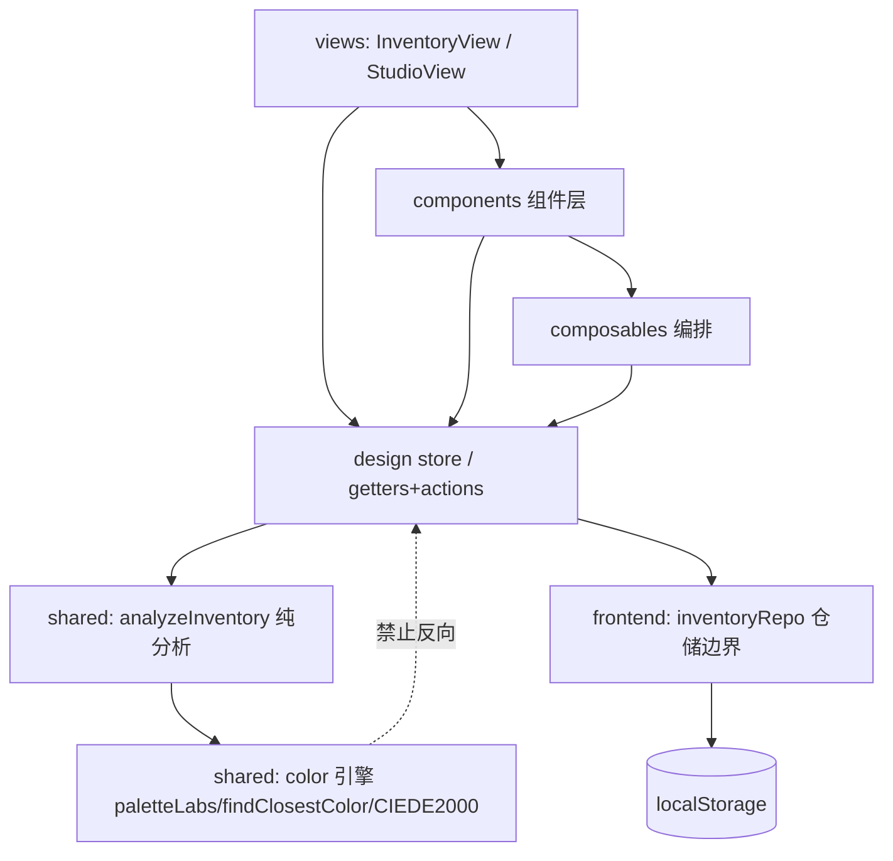
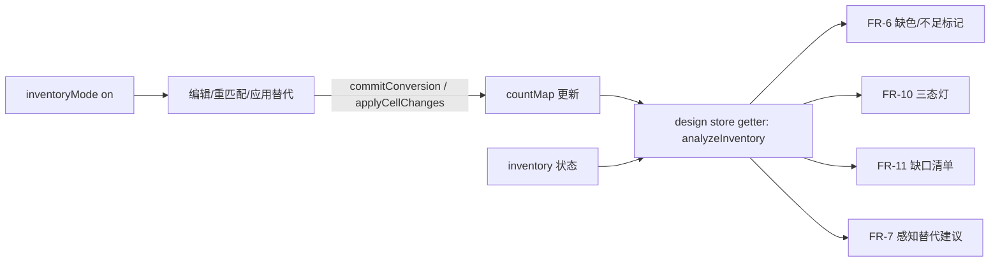

# Architecture Spine — 库存驱动设计

把现有 CIEDE2000 引擎「反着用」：颜色匹配的候选从「品牌全色板」缩到「用户真实拥有的子集」，缺色时做感知最优替代。本脊柱只钉死「库存驱动」这层新功能里、下游各 story 独立开发会跑偏的非显然决策；其余延续既有架构，不重述。

## Design Paradigm

延续既有范式，不新立：

- **`@pindou/shared` = 框架无关纯核心**：所有库存的纯计算（候选掩码、可拼性判定、缺口、感知替代选色）是纯函数，复用 CIEDE2000，可单测，零 Vue 依赖。
- **`@pindou/frontend` = Vue 响应式壳**：`store`（Pinia options-store）持有状态与响应式派生；`composables` 编排；`components` 呈现。
- **库存模式 = 叠加约束层**：不改既有索引语义与数据流，只在重匹配/替代时**收窄候选**。关闭即完全回到基线（AD-7）。

依赖方向（谁可依赖谁；越界即违规）：



## Invariants & Rules

### AD-1 — grid 颜色索引恒指品牌色板，库存模式不改索引语义 `[ADOPTED]`

- **Binds:** FR-4, FR-5, FR-7, FR-8；三不变量③（索引 ∈ `[-1, palette.colors.length)`）
- **Prevents:** 两个 story 对「grid 索引现在指向谁」做出不兼容假设；切板 / 导出 / 撤销路径上的索引错位回归。
- **Rule:** `BeadGrid` 的索引**永远**是当前**品牌色板**索引（与基线一致）。「库存色板」不是独立 `Palette`、不另起索引空间，而是品牌索引空间上的**候选掩码** `InventoryMask`（拥有数量 > 0 的品牌索引集合）。重匹配（FR-5）与感知替代（FR-7/8）只把 `findClosestColor` 的候选缩到掩码内，**写回 grid 的恒为品牌色板索引**。「拥有数量 > 0」谓词与「`BeadColor.id` → 品牌索引」的连接**只在 `analyzeInventory` 内计算一次**（AD-5）；`inventoryRepo` 只存原始 `{colorId, qty}` 条目、**不另算掩码**，杜绝 repo 侧与分析侧在 `qty === 0` 处给出分歧。

### AD-2 — 库存数据契约集中在 shared，键用 BeadColor.id `[ADOPTED]`

- **Binds:** FR-1, FR-2, FR-10, FR-11；跨包数据契约铁律
- **Prevents:** frontend 另立平行类型；不同 story 用不同键标识同一颜色导致条目对不上。
- **Rule:** `Inventory` / `InventoryEntry` / `BuildabilityVerdict` / `ShortfallItem` 等全部定义在 `shared/src/types.ts` 并从 `index.ts` 重导出。库存条目以 `BeadColor.id`（palette 内稳定）为键——**不用** `code`（可空）或数组下标（脆）。

### AD-3 — 库存纯逻辑下沉 shared，store/composable 只编排 `[ADOPTED]`

- **Binds:** FR-5, FR-6, FR-7, FR-10, FR-11
- **Prevents:** Vue 层散落业务算法、无法单测、与引擎重复实现。
- **Rule:** 可拼性判定、缺口计算、感知替代候选选择、掩码推导，一律是 `shared` 的框架无关纯函数（复用 `paletteLabs`/`findClosestColor`/`ciede2000`）。`store`/`composable` 只做状态编排与经合法路径的写回，不在 Vue 层重写这些算法。

### AD-4 — 库存持久化只走单一仓储边界 + 版本信封 + 按品牌分键 `[ADOPTED]`

- **Binds:** FR-2
- **Prevents:** 第二个 story 直接 `localStorage.setItem` 把 schema 写歪；未来「JSON 导出/导入备份」与「云同步」需重写。
- **Rule:** 所有库存读写只经单一仓储模块（`inventoryRepo`）边界，组件/ store 不直接碰 `localStorage`。落盘用版本化信封 `{ schema_version: number, paletteId: string, entries: InventoryEntry[] }`，按 **`Palette.id`**（如 `'perler-30'`）分键独立保存、互不覆盖——**不用 `Palette.brand`**（代码无独立 `brandId`，同 brand 多 palette 会撞键）。`schema_version` 为**整数、单调递增**，迁移逻辑收在 repo 内。读取时若某 `colorId` 在当前 palette 解析不到，**直接丢弃该条目**，不得回退为 `-1`（会污染掩码、撞 grid 的空格哨兵 `-1`）。介质=localStorage（数据 KB 级）；换云同步/备份只换该模块后端，不改上层契约。

### AD-5 — 库存派生数据走单一派生源 `[ADOPTED]`

- **Binds:** FR-6, FR-7, FR-9, FR-10, FR-11
- **Prevents:** FR-6 画布标记 / FR-10 三态灯 / FR-11 缺口清单 / FR-7 替代建议各自从 `grid + inventory` 重算，对同一源头得出不一致结论（如某色标黄但灯却绿）。
- **Rule:** 一个纯函数 `analyzeInventory(grid, brandPalette, inventory) → InventoryAnalysis` 一次算出全部派生结论（入 `shared`，输出**必须定型**为 `shared/types.ts` 的具名类型，键法不得留白）：
  - `mask: InventoryMask`（`Set<number>`，**品牌色板索引**，与 grid 同空间）
  - `perColorStatus: Record<number, 'ok' | 'insufficient' | 'missing'>`（**以品牌色板索引为键**，与 `grid[r][c]` 同空间——FR-6 画布按索引直查，无需 id↔index 二次解析）
  - `verdict: BuildabilityVerdict`（三态枚举，见下）
  - `shortfall: ShortfallItem[]`，每项含 `{ colorId, index, kind: 'missing' | 'insufficient', deficit, note }`（**双带 `colorId` 与 `index`**，消除清单读 id / 画布读 index 的不兼容读法）
  - `substitutions: Substitution[]`，每项含 `{ fromIndex, toIndex, deltaE, affectedCells }`（方向明确：`from` 缺色品牌索引 → `to` 库存内品牌索引）
  - **空态契约**：`inventory`/`mask` 为空时返回确定值（`verdict` 取「不可用·引导录入」、`substitutions = []`、**不抛错**），不得让 FR-6/FR-7/FR-10 各自猜测空态。
  `store` 用**单一响应式 getter** 暴露其结果（依赖 `countMap` + `inventory` + `inventoryMode`）；所有 story 读此唯一出口，不各自重算。粒度=整体重算（数千格级，遵性能约定**不引 Worker**）。FR-6/FR-11 的「编辑后即时刷新」由此 getter 的响应性免费获得。

### AD-6 — 写回 grid 只经 store 合法路径，守三不变量 `[ADOPTED]`

- **Binds:** FR-5, FR-8
- **Prevents:** 重匹配/应用替代直改 `grid`，使 `countMap`、行列、索引范围三不变量静默破裂（UI 不报错但统计/导出错）。
- **Rule:** 写回 grid 必须经 store 合法路径。**逐格改写经 `applyCellChanges`**（返回反向变更，记单条历史）；**整图重算经 `commitConversion`**（注意其副作用，见 AD-9）。

### AD-7 — 库存模式是叠加可选层，关闭零回归 `[ADOPTED]`

- **Binds:** FR-4；SM-C2
- **Prevents:** 库存逻辑渗入基线转珠路径，劣化或改变关模式时的行为。
- **Rule:** `inventoryMode` 默认关闭；关闭时颜色匹配、画布渲染、材料清单、性能与基线**完全一致、零回归**。所有库存派生、标记、三态灯只在 `inventoryMode === true` 时参与计算与渲染。

### AD-8 — ΔE 阈值与状态色为单一来源常量 `[ADOPTED]`

- **Binds:** FR-9, FR-6, FR-10；SM-C1
- **Prevents:** 视觉影响分级与三态判据在多处各写一份阈值，标定后不一致。
- **Rule:** ΔE 分级阈值（初值 低<2 / 中 2–5 / 高>5，待真实图纸标定）作为 `shared` 单一常量来源，标定只改一处。三态灯 / 标记的语义色复用既有 Vuetify 主题槽位（success/warning/error/accent），不引入新色相；标记须**双编码**（颜色 + 图标/纹理），色盲可辨（见 UX 规格）。

### AD-9 — 重匹配/应用替代须保留撤销与"替代前"基线，记为独立单条历史 `[ADOPTED]`

- **Binds:** FR-5, FR-8, FR-9；SM-C2
- **Prevents:** 裸调 `commitConversion`（既有实现**不记历史、且重置 `originalGrid`**）使重匹配/应用替代**不可撤销**、且毁掉 FR-9「替代前/后」对比所需的基线。
- **Rule:** 重匹配（FR-5）与应用感知替代（FR-8）虽是整图级写回，但**不得裸调 `commitConversion` 丢历史**——须经能记录撤销的路径（如以 diff 形式走 `applyCellChanges`，或扩展 store 提供「记历史的整图提交」），保留可整体回退能力。二者**各记为独立的单条历史条目**（重匹配一条、应用替代一条，不合并）。FR-9 的「替代前」画布基线在应用前必须可得。

## Consistency Conventions

| Concern | Convention |
| --- | --- |
| 命名（类型/术语） | 严格逐字用 PRD 术语表：`Inventory` 库存 / `InventoryEntry` 库存条目 / `BrandPalette` 品牌色板 / `InventoryMask` 库存色板 / `inventoryMode` 库存模式 / `MissingColor` 缺色 / `Insufficient` 数量不足 / `PerceptualSubstitution` 感知替代 / `BuildabilityVerdict` 可拼性判定 / `ShortfallItem` 缺口项。不引同义词。 |
| 库存条目键 | `BeadColor.id`（AD-2） |
| 持久化信封 | `{ schema_version: number, paletteId, entries: InventoryEntry[] }`，按 `Palette.id` 分键（AD-4） |
| 派生输出键 | `perColorStatus`/`substitutions` 用**品牌索引**为键（与 grid 同空间）；`shortfall` 项双带 `colorId`+`index`（AD-5） |
| 三态判据 | 绿=全色在掩码内且量足；黄=有缺色但全部缺色都能在掩码内找到替代（**不承诺数量精算到颗**）；红=有色连替代都进不了掩码（AD-5；不做替代色级联校验） |
| 标记 vs 清单 | **缺色**做逐格画布标记（accent 暖橙 + 纹理/图标双编码）；**数量不足**只在材料清单/缺口清单呈现（error 红），**不做逐格画布标记**（UX：壳克制、不抢画布焦点） |
| 库存模式入口 | 库存为空时开关**禁用并引导**去 `/inventory` 录入（不是开了再报错） |
| 数量数字旁必带人话 | 缺口清单每行除数字外缀引擎可算、用户可读的解读句（如「够铺这张图，余量紧张」「还差约 N 颗」）（FR-11 party-mode 决议） |
| i18n | 新增每个文案 key 同时补 `en`/`zh`（构建门禁）；非组件上下文用导出的 `t()` |
| 写回路径 | 一律经 `commitConversion`/`applyCellChanges`，单条撤销历史（AD-6） |
| 仓储访问 | 库存读写只经 `inventoryRepo`，不直接碰 `localStorage`（AD-4） |
| 导出 | 缺口清单仅纯文本/剪贴板，不入 PDF、不含采购链接 |

## Stack

> SEED — 既有 brownfield 现实，由代码拥有；本 feature **不引入任何新依赖**（localStorage 为浏览器原语）。

| Name | Version |
| --- | --- |
| Vue | ^3.4 |
| Vuetify | ^3.5 |
| Pinia | ^2.1 |
| vue-i18n | ^9.13 |
| Vite | ^5.2 |
| TypeScript（shared 纯 ESM, ES2020） | ^5.4 |
| Vitest / Playwright(chromium) | ^1.5 / ^1.44 |
| 持久化介质 | localStorage（浏览器原语，无新依赖） |

## Structural Seed

新增代码落点（沿用既有目录范式；现有文件不重列）：

```text
packages/
  shared/src/
    types.ts                  # + Inventory/InventoryEntry/BuildabilityVerdict/ShortfallItem（AD-2）
    inventory/                # 新增：库存纯逻辑（框架无关，复用 color 引擎）
      analyze.ts              # analyzeInventory() 单一派生源（AD-5）
      thresholds.ts           # ΔE 分级阈值单一常量（AD-8）
      index.ts
  frontend/src/
    stores/design.ts          # + inventory / inventoryMode 状态 + 单一派生 getter（AD-5/7）
    services/inventoryRepo.ts # 新增：localStorage 仓储边界 + 版本信封（AD-4）
    views/InventoryView.vue   # 新增：独立库存录入/维护页（FR-1~3；混合 IA）
    router/index.ts           # + /inventory 路由（懒加载，沿用既有范式）
    vite.config.ts            # 同步 sitemap url 列表 + SITE_URL（新增路由部署铁律）
    components/               # Studio 内：库存面板 / 三态灯(VChip) / 缺色标记(BeadCanvas 叠加) / 替代预览卡
    plugins/i18n.ts           # + 库存相关 en/zh 文案（门禁）
```

> **混合 IA（UX EXPERIENCE 决定）**：录入/维护这件"重活"放**独立 `/inventory` 顶级视图**（宽敞、不挤占编辑器）；Studio 内只放**轻量库存面板**——开关库存模式、看可拼性/缺口、触发感知替代。新增 `/inventory` 路由**必须**同步更新 `vite.config.ts` 的 sitemap url 列表（否则页面静默掉出 SEO——project-context 部署铁律）。

库存模式数据流（一笔编辑后即时刷新如何免费拿到）：



## Capability → Architecture Map

| FR / 能力 | Lives in | Governed by |
| --- | --- | --- |
| FR-1 按色卡勾选+填量录入 | `InventoryView` → store → `inventoryRepo` | AD-2, AD-4 |
| FR-2 本地持久化与维护 | `services/inventoryRepo.ts` | AD-4 |
| FR-3 快捷批量操作 | `InventoryView` 批量条 → `inventoryRepo` | AD-2, AD-4 |
| FR-4 库存模式开关 | `store.inventoryMode`（空库存禁用引导） | AD-7；库存模式入口约定 |
| FR-5 以库存色板重匹配 | `shared/inventory` 候选掩码 + 记历史的整图写回 | AD-1, AD-3, AD-9 |
| FR-6 缺色/不足可视标记 | `BeadCanvas` 叠加 ← 派生 getter（按索引直查） | AD-5, AD-8；标记vs清单约定 |
| FR-7 感知替代建议 | `shared/inventory/analyze` | AD-1, AD-3, AD-5 |
| FR-8 应用感知替代（整色替换） | store 记历史整图写回（独立单条历史） | AD-1, AD-6, AD-9 |
| FR-9 替代影响预览（前/后对比） | 预览卡 ← 派生 getter + 阈值常量 + 基线 | AD-5, AD-8, AD-9 |
| FR-10 三态可拼性判定 | `shared/inventory/analyze` → VChip 灯 | AD-5 |
| FR-11 缺口清单（带人话） | `shared/inventory/analyze` → 列表组件 | AD-5；缺口解读约定 |

## Deferred

- **账号体系 / 云端库存同步**：v1 不做；AD-4 已把持久化收在仓储边界后，云同步=换后端。
- **JSON 导出/导入备份**：本地存储有清缓存丢失风险的轻量过渡方案；架构已预留（同 AD-4），非 v1 交付。
- **跨品牌色板替代**：v1 假设替代只在同一品牌的库存色板内；`analyzeInventory` 按单品牌签名设计，跨品牌为未来扩展（PRD Open Q6）。
- **逐格/逐色手动指定替代色**：v1 仅自动建议+整色替换；手动微调走既有画笔/取色，不在本契约。
- **替代色库存级联校验（精算到颗）**：产品定位明确不做（party-mode 决议）；数量透明由 FR-11 缺口清单承担。
- **拍照/订单截图辅助录入**：属「实拍数字化」方向，未来。
- **部署/运维envelope**：纯前端客户端特性，无新基础设施；沿用既有 GitHub Pages / 可选 CDK 路径，本 feature 不触及。
- **ΔE 阈值定稿值**：AD-8 已固定「单一常量来源」结构；具体数值待真实图纸标定（动工前必做任务，非架构开放项）。
